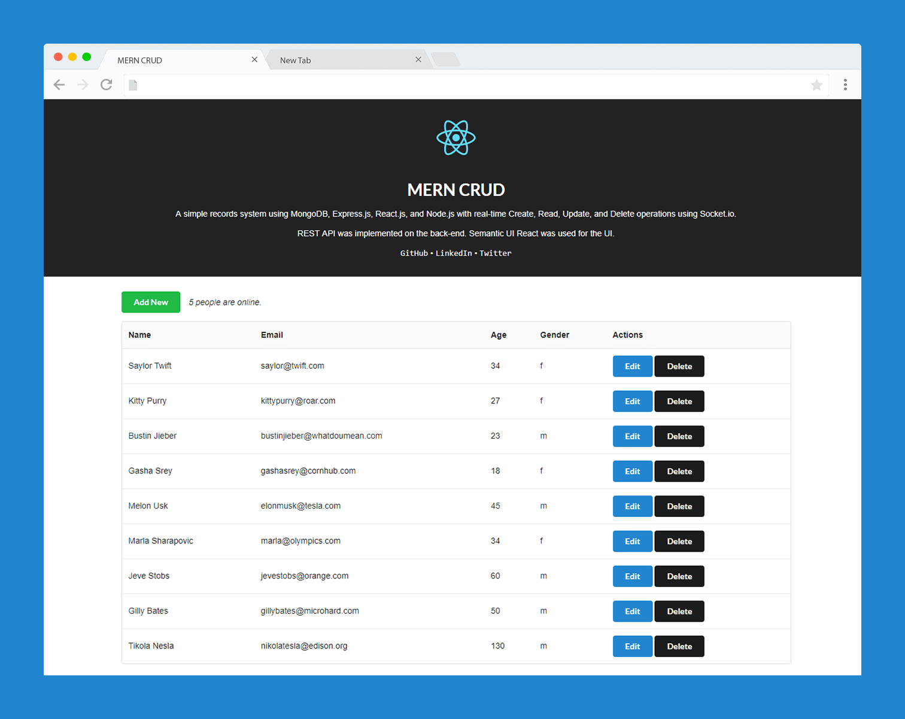

# MERN CRUD

A simple records system using MongoDB, Express.js, React.js, and Node.js with real-time Create, Read, Update, and Delete operations using Socket.io. REST API was implemented on the back-end. Semantic UI React was used for the UI.

